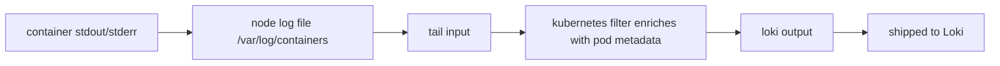

# Fluent Bit

```
container stdout/stderr  →  node log file  →  tail input  →  kubernetes filter enriches  →  shipped to Loki
```



## What It Is

Fluent Bit is a lightweight log processor and forwarder. It runs as a
**DaemonSet** — one pod per node — reads container log files directly off
each node's disk, parses/enriches them, and ships them to a log backend
(here: Loki). It's the C-based, low-footprint sibling of Fluentd,
purpose-built for exactly this "sidecar/daemon shipping node logs
somewhere" role.

## Why We Use It Here

It's the collection layer feeding Loki. A DaemonSet is the natural shape
for this job: Kubernetes already writes every container's stdout/stderr
to a predictable path on the node's filesystem
(`/var/log/containers/*.log`), so a per-node agent that tails those files
is far cheaper than any approach requiring the application itself to ship
its own logs.

## How It Works — Internals

Fluent Bit's config is a **pipeline**: `INPUT → FILTER → OUTPUT`, and
this repo's `values.yaml` maps directly onto that three-stage shape.

- **Input stage (`tail`):** Fluent Bit tails every file matching
  `/var/log/containers/*.log`. Kubernetes writes one log file per
  container here, with the filename itself encoding pod name, namespace,
  and container name — this convention is what lets the next stage
  enrich each line without querying anything yet.
- **`multiline.parser docker, cri`:** container runtimes (Docker vs
  containerd/CRI-O) wrap each log line differently (JSON-wrapped vs
  plain-text with a CRI-specific prefix), and either can split a single
  logical log line (e.g. a stack trace) across multiple physical lines.
  This parser normalizes both formats and reassembles multiline entries
  back into one record before tagging.
- **Tagging (`Tag kube.*`):** every ingested record gets tagged
  `kube.<derived-from-path>`. Tags are Fluent Bit's internal routing
  key — the `Match kube.*` clauses in the filter and output stages both
  key off this tag to decide which records they apply to. Nothing here
  is routed by content, only by tag.
- **Filter stage (`kubernetes` filter):** this is where the real
  enrichment happens. For each tagged record, the filter parses the pod
  name/namespace/container name back out of the tag/log path, then
  queries the **Kubernetes API server** (via the pod's ServiceAccount)
  to fetch that pod's metadata — labels, annotations, pod UID, node
  name — and merges it into the record.
  - `Merge_Log On` — if the log line itself is JSON, its fields get
    merged into the top-level record instead of staying as a nested
    string, making structured app logs directly queryable.
  - `K8S-Logging.Parser On` / `K8S-Logging.Exclude On` — honors
    per-pod annotations (`fluentbit.io/parser`, `fluentbit.io/exclude`)
    so individual workloads can opt into a custom parser or opt out of
    log collection entirely without touching this shared config.
- **Output stage (`loki`):** the enriched record is shipped to Loki's
  push API over HTTP. `Labels job=fluent-bit` sets one static label on
  every record from this pipeline. `Auto_Kubernetes_Labels On` promotes
  the *pod's Kubernetes labels* (fetched by the filter stage above) into
  Loki labels automatically — this is the mechanism that gives Loki
  labels like `app` or whatever label keys your workloads happen to
  carry, without listing them one by one in this config.
- **Buffering:** `Mem_Buf_Limit 5MB` caps how much unflushed log data the
  input stage will hold in memory before it starts dropping (with
  `Skip_Long_Lines On`, individual over-long lines are skipped rather
  than blocking the whole buffer). This is a backpressure safety valve,
  not a durability guarantee — there's no persistent buffer configured,
  so a Fluent Bit pod crash loses whatever was in memory and not yet
  flushed to Loki.

## Setup

Deployed together with Loki via ArgoCD (see `logging/loki` bootstrap in
`notes/loki.md` — both apps are pushed and applied in the same step):
```bash
git add logging/ argocd/apps/logging.yaml argocd/apps/fluent-bit.yaml
git commit -m "Add Loki and Fluent Bit"
git push
kubectl apply -f argocd/apps/logging.yaml -f argocd/apps/fluent-bit.yaml
argocd app sync loki && argocd app sync fluent-bit
```

## Configuration Deep Dive

`logging/fluent-bit/values.yaml`, section by section:

```ini
[INPUT]
    Name tail
    Path /var/log/containers/*.log
    multiline.parser docker, cri
    Tag kube.*
    Mem_Buf_Limit 5MB
    Skip_Long_Lines On
```
- `Path /var/log/containers/*.log` relies on the DaemonSet mounting the
  node's `/var/log` into the pod (standard for this chart) — Fluent Bit
  is reading the *node's* log files, not anything inside its own
  container filesystem.
- `multiline.parser docker, cri` — listing both means this one pipeline
  correctly parses logs regardless of which container runtime produced
  them, useful if the cluster ever mixes runtimes across nodes.

```ini
[FILTER]
    Name kubernetes
    Match kube.*
    Merge_Log On
    Keep_Log Off
    K8S-Logging.Parser On
    K8S-Logging.Exclude On
```
- `Keep_Log Off` — once `Merge_Log On` has hoisted a JSON log body's
  fields to the top level, the original raw `log` string field is
  dropped rather than kept alongside the merged fields, avoiding
  duplicate data in every record.

```ini
[OUTPUT]
    Name loki
    Match kube.*
    Host loki.logging.svc.cluster.local
    Port 3100
    Labels job=fluent-bit
    Auto_Kubernetes_Labels On
```
- `Host loki.logging.svc.cluster.local` — in-cluster DNS name for the
  Loki `Service`, same namespace (`logging`), so this only resolves from
  inside the cluster.
- **This is the exact spot the known `namespace`-label gap lives.**
  `Auto_Kubernetes_Labels On` promotes *pod labels* (e.g. whatever's in
  the pod's `metadata.labels`) — it does not add the pod's *namespace*
  as a label, because namespace isn't a pod label, it's a separate field
  the `kubernetes` filter fetches. The fix is adding it explicitly here,
  e.g. a static/templated `Labels` entry or enabling the chart's
  namespace-label option if the fluent-bit output plugin supports it —
  not yet implemented in this config.

## Verify

```bash
# All pods running, one per node
kubectl get pods -n logging
# Expected: fluent-bit-* (1/1) per node

# Confirm Loki is receiving fluent-bit's data (see loki.md for the labels-endpoint check)
```
Since Fluent Bit has no query API of its own, verification is really
"does Loki show data tagged `job=fluent-bit`" — see `notes/loki.md`'s
Verify section for the label-listing and Explore query.

## What To Look For / Troubleshooting

- **No `namespace` label in Loki, only pod labels** → known/expected gap,
  not a bug. Filter with `{job="fluent-bit"}` and grep log content for
  the namespace string as a workaround until the output `Labels` config
  is fixed to include it explicitly.
- **A pod's structured JSON logs show up as one flat string instead of
  parsed fields** → check `Merge_Log On` is in effect and that the log
  line is actually valid JSON; malformed JSON silently falls back to
  being treated as plain text.
- **Logs missing entirely from a specific workload** → check for a
  `fluentbit.io/exclude: "true"` annotation on that pod
  (`K8S-Logging.Exclude On` honors it) before assuming a pipeline bug.
- **Fluent Bit pod `CrashLoopBackOff` or dropping logs under load** →
  check `Mem_Buf_Limit` isn't being hit; 5MB is small and a bursty
  logging workload can exceed it, causing drops (not crashes, but silent
  data loss) rather than backpressure on the source.
- **kubernetes filter not enriching records (no pod labels at all)** →
  usually a ServiceAccount/RBAC issue — the filter needs API access to
  the cluster to fetch pod metadata; check the Fluent Bit ServiceAccount
  has the expected `get`/`list`/`watch` on pods.
