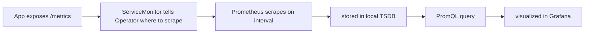

# Prometheus + Grafana (kube-prometheus-stack)

```
app exposes /metrics  →  Prometheus scrapes on interval  →  stored in local TSDB  →  queried via Grafana
```



## What It Is

`kube-prometheus-stack` is a Helm chart that bundles the **Prometheus
Operator** plus a full monitoring stack: Prometheus itself, Grafana,
Alertmanager, node-exporter, kube-state-metrics, and a set of default
Kubernetes dashboards and scrape configs. Prometheus is a pull-based
time-series database — it scrapes `/metrics` HTTP endpoints on a schedule
and stores the results as time series. Grafana is the visualization layer
on top.

## Why We Use It Here

It's the metrics half of observability in this stack (Loki/Fluent Bit is
the logs half). The Operator pattern specifically matters for this repo's
GitOps model: instead of hand-editing `prometheus.yml` scrape configs,
scrape targets are declared as Kubernetes custom resources
(`ServiceMonitor`, `PodMonitor`) that live in Git like everything else —
so adding a scrape target is a Git change, not a manual Prometheus config
edit.

## How It Works — Internals

- **The Operator is a controller, not Prometheus itself.** It watches for
  `Prometheus`, `Alertmanager`, `ServiceMonitor`, `PodMonitor`, and
  `PrometheusRule` custom resources. When it sees a `Prometheus` CR, it
  generates a `StatefulSet` running the actual Prometheus binary,
  assembles the full scrape config from every matching `ServiceMonitor`/
  `PodMonitor` in the cluster, and drops it into Prometheus as a secret
  that gets reloaded live (no restart needed).
- **`ServiceMonitor` → scrape target, indirectly.** A `ServiceMonitor`
  doesn't point at pods directly — it selects a `Service` by label, and
  Prometheus discovers the `Service`'s backing endpoints (pods) via the
  Kubernetes API, the same way `kube-proxy` would. This is why exposing
  custom metrics from an app requires a `Service` in front of it, not
  just a pod with a `/metrics` port.
- **Storage is a local TSDB (time-series database) per Prometheus pod,**
  written as 2-hour immutable blocks to disk, then compacted in the
  background. There's no separate database process — the TSDB is an
  embedded storage engine inside the Prometheus binary itself. This is
  why `storageSpec: {}` (emptyDir, see below) means a pod restart loses
  all historical metrics: the TSDB blocks live on that ephemeral disk.
- **Pull, not push.** Prometheus initiates every scrape on its own
  interval (default 30s) by hitting each target's `/metrics` endpoint.
  Nothing pushes metrics *to* Prometheus under normal operation — this is
  why a target being "down" in the Prometheus UI usually means Prometheus
  couldn't reach it, not that the target failed to send anything.
- **Grafana dashboard/datasource provisioning here is sidecar-based, not
  database-based.** Grafana normally stores dashboards in its own SQLite/
  Postgres DB. This chart instead runs a sidecar container in the Grafana
  pod that watches for `ConfigMap`s labeled for dashboards/datasources
  and writes them to Grafana's provisioning directory on disk. That means
  dashboards can be committed to Git as ConfigMaps and Grafana needs no
  database at all — consistent with this cluster having no
  PersistentVolumes.

## Setup

Deploy via ArgoCD — push to Git first, since ArgoCD reads `values.yaml`
from the repo, not the local filesystem:
```bash
git add monitoring/prometheus/values.yaml argocd/apps/monitoring.yaml
git commit -m "Add kube-prometheus-stack"
git push
kubectl apply -f argocd/apps/monitoring.yaml
argocd app sync monitoring
```

Get Grafana's NodePort:
```bash
kubectl get svc -n monitoring | grep grafana
```

**Local machine** (same network as cluster):
```
http://10.124.224.145:31689
```

**Remote machine** (SSH tunnel):
```bash
ssh -L 3000:10.124.224.145:31689 dell
# Open: http://localhost:3000
```

Login: `admin / gitops1234`

## Configuration Deep Dive

`monitoring/prometheus/values.yaml`, key by key:

```yaml
grafana:
  adminPassword: "gitops1234"
  service:
    type: NodePort
  sidecar:
    dashboards:
      enabled: true
    datasources:
      enabled: true
```
- `service.type: NodePort` — same reasoning as ArgoCD: no ingress
  controller in this cluster, so services are exposed directly on a node
  port.
- `sidecar.dashboards`/`sidecar.datasources: enabled: true` — turns on
  the ConfigMap-watching sidecar described above. Without this, adding a
  dashboard means manually importing it through the Grafana UI, which
  doesn't survive a pod restart (no persistent storage) and isn't
  tracked in Git.

```yaml
alertmanager:
  enabled: false
```
- Alertmanager (routing/deduping/silencing alerts to Slack, email, etc.)
  is disabled. `PrometheusRule` alerts still evaluate and show as firing
  in the Prometheus UI even without it — Alertmanager is only needed once
  alerts need to actually notify somewhere.

```yaml
prometheus:
  prometheusSpec:
    retention: 7d
    storageSpec: {}
```
- `retention: 7d` — how long the TSDB keeps data before compacting it
  away. Set low deliberately since there's no persistent disk backing it
  anyway.
- `storageSpec: {}` — same emptyDir pattern as Loki: no
  PersistentVolumes exist in this cluster, so Prometheus's TSDB lives on
  the pod's ephemeral disk and is lost on restart. Acceptable for this
  setup; would need a real PV/StorageClass for production retention
  guarantees.

## Verify

```bash
# All pods running
kubectl get pods -n monitoring

# Grafana and Prometheus services with NodePorts
kubectl get svc -n monitoring

# Check Prometheus targets — all should be UP
kubectl port-forward svc/monitoring-kube-prometheus-prometheus -n monitoring 9090:9090
# Open: http://localhost:9090/targets
```
A target in `DOWN` state on that page means Prometheus tried to scrape it
and got a connection error/timeout/non-200 — check the target pod is
running and its `/metrics` port matches what the `ServiceMonitor`
declares.

```bash
# In Grafana:
# Dashboards > Browse > Node Exporter / Nodes — live CPU, RAM, disk per node
# Dashboards > Browse > Kubernetes / Pods — pod-level metrics
# Explore > Prometheus > run query: up
```
`up` is the simplest possible query — `1` per scrape target that
succeeded on the last scrape, `0` for a target that failed. It's the
fastest way to confirm the whole scrape pipeline end-to-end without
opening the `/targets` page.

## What To Look For / Troubleshooting

- **Dashboard/datasource added but not showing in Grafana** → confirm the
  `ConfigMap` has the label the sidecar watches for (chart default is
  `grafana_dashboard: "1"` / `grafana_datasource: "1"`); the sidecar only
  picks up labeled ConfigMaps, not just any ConfigMap in the namespace.
- **Metrics missing after a pod restart** → expected, not a bug —
  `storageSpec: {}` means TSDB data doesn't survive restarts in this
  cluster.
- **Target shows in `ServiceMonitor` but not in Prometheus's target
  list** → check the `ServiceMonitor`'s label selector actually matches
  the `Service`'s labels, and that the `Service` itself has endpoints
  (`kubectl get endpoints <svc>`).
- **Alert rule defined but nothing "firing" visible anywhere useful** →
  remember Alertmanager is disabled; firing alerts are only visible in
  the Prometheus UI's Alerts tab, they won't route anywhere.
